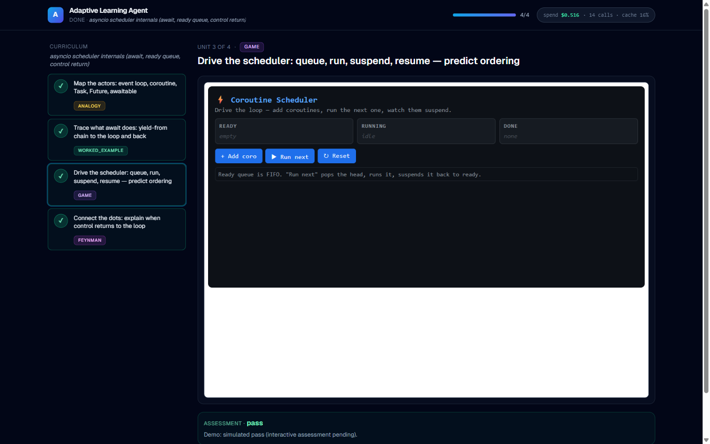

# adaptive-learning-agent

> State a goal. The agent constructs a path, teaches each concept using the pedagogy best suited to it — games, analogies, worked examples, Socratic dialogue, retrieval — and assesses understanding before advancing.



---

## Thesis

In the AI era, depth in one skill is brittle. **Range** and the ability to **reskill quickly** are the durable assets.

This is infrastructure for that ability — learn anything, fast, joyfully. A personal proof-of-work project.

---

## What's in the box

- **Multi-agent workflow** — Intent → Curriculum → Router → Teach → Assess → Memory, with backedges for retry and revision. Not a monolithic prompt. Not an agent framework.
- **Programmatic tool calling (PTC).** Hand-rolled orchestration loop. Every agent boundary is a [Pydantic schema](backend/schemas/) — no free-form dict passing.
- **Grounded curricula.** Every unit cites a retrievable source. Validated by the [grounding evaluator](evals/evaluators/grounding.py).
- **Flagship pedagogy: on-the-fly game generation.** Concept-as-interaction micro-games rendered in a sandboxed iframe. See [demo-game-live.png](demo-game-live.png).
- **SSE streaming** to the frontend — every stage of the session emits a typed event ([backend/schemas/events.py](backend/schemas/events.py)).
- **Evals first-class** — 7 evaluators, 23 golden cases across 3 domains, runnable from a single CLI.
- **183 tests, ruff clean.**

---

## Architecture at a glance

```
                                ┌──────────────── backedges ───────────────┐
                                │                                          │
                                ▼                                          │
┌────────┐   ┌────────────┐   ┌──────────┐   ┌───────┐   ┌──────────┐      │
│ Intent │──▶│ Curriculum │──▶│ Pedagogy │──▶│ Teach │──▶│  Assess  │──────┤
└────────┘   └────────────┘   │  Router  │   └───────┘   └──────────┘      │
     ▲             ▲          └──────────┘        ▲           │            │
     │             │                               └── retry ─┘            │
     │             └──── revise-curriculum (N consecutive failures) ───────┘
     │
     └── LearnerState ──▶ Memory ──▶ SQLite
```

Outer graph is a deterministic workflow. Nodes are agentic LLM calls with schema-grounded I/O. Full topology in [ARCHITECTURE.md](ARCHITECTURE.md).

### Agent roster

| Agent              | Model    | Role                                                   |
| ------------------ | -------- | ------------------------------------------------------ |
| Intent             | Sonnet   | Conversational goal extraction → `LearningGoal`        |
| Curriculum         | Opus     | Web research + ordered plan; every unit grounded       |
| Pedagogy Router    | rules → Opus | Pick teaching method for this unit + learner state |
| Game *(flagship)*  | Sonnet   | Generate self-contained HTML/JS micro-game             |
| Worked Example     | Sonnet   | Stepwise example with fading                           |
| Analogy / Visual / Socratic / Feynman / Retrieval | Sonnet | Stubs in v1                  |
| Assessment         | Sonnet   | pass / retry-same / retry-different                    |
| Memory             | pure fn  | LearnerState, persisted to SQLite                      |

---

## The three domains

v1 ships the loop end-to-end across three domains, picked to stress different pedagogies:

| Domain                    | Why                                       |
| ------------------------- | ----------------------------------------- |
| **SQL joins**             | Technical, visual-friendly, game-friendly |
| **Italian for travel**    | Language, retrieval/spaced-repetition     |
| **How neural nets learn** | Conceptual, analogy-heavy                 |

---

## The seven evaluators

| Evaluator             | Kind                            | Signal                                                |
| --------------------- | ------------------------------- | ----------------------------------------------------- |
| Intent Fidelity       | LLM judge                       | Predicted goal matches gold per-field rubric          |
| Curriculum Coherence  | LLM judge                       | Ordering, completeness, scope, pedagogy fit           |
| Grounding             | deterministic (+ optional HTTP) | Structural + source diversity + reachability          |
| Pedagogy Fit          | deterministic                   | Router's method ∈ gold `acceptable_methods`           |
| Game Quality          | LLM judge + gates               | Solvable, on-concept, engagement + playability gate   |
| Assessment Accuracy   | deterministic                   | Verdict matches human gold                            |
| Learning Gain         | deterministic                   | post_score − pre_score ≥ threshold                    |

Deterministic evaluators run with no API key. Judge-based evaluators need `ANTHROPIC_API_KEY`.

---

## Setup

Prereqs: Python 3.11+, Node.js 20+, [`uv`](https://docs.astral.sh/uv/).

```bash
# backend
uv venv
uv pip install -e ".[dev]"
cp .env.example .env   # then fill in ANTHROPIC_API_KEY + TAVILY_API_KEY

# frontend
cd frontend && npm install
```

## Run

```bash
# backend (from repo root)
uv run uvicorn backend.main:app --reload

# frontend (in a second terminal)
cd frontend && npm run dev
```

Open [http://localhost:3000](http://localhost:3000) and click **Start session**. The frontend consumes the SSE stream from `/api/session/run` and renders each event type — `intent_update`, `curriculum_ready`, `unit_started`, `teaching_chunk`, `assessment_result`, `complete`. Games render in sandboxed iframes.

Headless verification:

```bash
curl -N -X POST http://127.0.0.1:8000/api/session/run \
  -H "Content-Type: application/json" \
  -d '{"goal":{"domain":"databases","sub_goal":"INNER vs LEFT joins",
       "current_level":"beginner","desired_depth":"working",
       "time_budget_hours":2.0,"preferred_modalities":["visual"]},
       "user_id":"demo"}'
```

## Test

```bash
uv run pytest                  # 183 tests
uv run ruff check .            # lint
cd frontend && npm run build   # frontend typecheck + build
```

## Evals

```bash
# deterministic only — no API key needed
uv run python -m evals.runner --evaluator pedagogy
uv run python -m evals.runner --evaluator assessment --output report.json

# full suite (judge-based evaluators included)
uv run python -m evals.runner --all --output eval_report.json
```

The runner prints a summary, optionally writes a JSON report, and exits non-zero if any case fails.

---

## Scope

**v1 is:** single-user, local-first, three hardcoded domains, one flagship pedagogy (on-the-fly game generation) done excellently. Other teaching methods ship as competent stubs.

**v1 is not:** auth, payments, mobile, multimedia, fine-tuning, multi-goal juggling, full synthetic-learner simulation for learning-gain.

---

## Repo map

```
adaptive-learning-agent/
├── backend/
│   ├── agents/          Intent, Curriculum, Router, Teaching/Game, Assessment, Memory
│   ├── schemas/         Pydantic models + SSE event union
│   ├── orchestration/   PTC harness, ToolRegistry, Anthropic client, SSE, logging
│   ├── retrieval/       Tavily wrapper + web_search Tool
│   ├── persistence/     SQLAlchemy async + LearnerState store
│   ├── api/             FastAPI /api/session/run (SSE)
│   └── main.py
├── frontend/            Next.js 14 + Tailwind, SSE consumer + sandboxed game iframe
├── evals/               7 evaluators, 23 golden cases, runner CLI
└── tests/               pytest, all agents/evaluators/persistence covered
```

## Deploy

Configs ship for the most common PaaS combos; pick one for the backend, Vercel for the frontend.

**Backend on Fly.io** (recommended):

```bash
fly launch --no-deploy           # claim the app name
fly secrets set ANTHROPIC_API_KEY=sk-ant-... TAVILY_API_KEY=tvly-...
fly secrets set ADAPTIVE_LEARNING_FRONTEND_ORIGIN=https://your-app.vercel.app
fly deploy                       # uses backend/Dockerfile + fly.toml
```

**Backend on Railway**: connect the GitHub repo; Railway auto-detects `railway.json` (Dockerfile build). Set the same env vars in the dashboard.

**Frontend on Vercel**: connect the GitHub repo, root = `frontend/`. Vercel auto-detects Next.js. Add one env var:

```
NEXT_PUBLIC_API_BASE_URL=https://<your-fly-or-railway-url>
```

After both are deployed, set `ADAPTIVE_LEARNING_FRONTEND_ORIGIN` on the backend to the Vercel URL so CORS allows it. Done — visit the Vercel URL.

**Cost-free demo**: append `?fixture=1` to the deployed frontend URL. Replays a recorded session locally without hitting the backend at all.

## Further reading

- [WRITEUP.md](WRITEUP.md) — design notes: PTC vs LangGraph, the MDA-grounded game agent, the prompt-cache gotcha, interactive assessment, roadmap
- [ARCHITECTURE.md](ARCHITECTURE.md) — full agent topology, principles, evaluator details
- [HANDOFF.md](HANDOFF.md) — original project brief and scope
- [backend/orchestration/ptc.py](backend/orchestration/ptc.py) — the tool-use loop
- [backend/api/session.py](backend/api/session.py) — the full session, end-to-end
